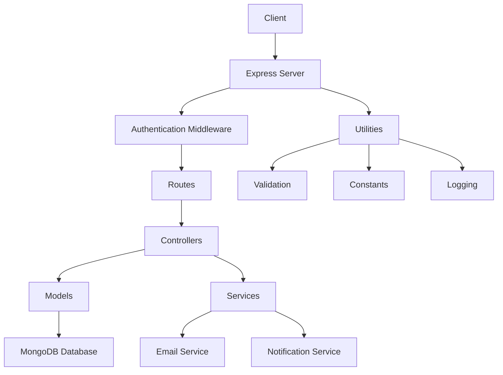

# SwiftDrive - Vehicle Rental Management System

## Project Overview
SwiftDrive is a comprehensive vehicle rental management system designed to provide a seamless booking and management experience for vehicle rentals.

## Technology Stack
- **Backend**: Node.js, Express.js
- **Database**: MongoDB, Mongoose
- **Authentication**: JSON Web Token (JWT)
- **Additional Libraries**: 
  - bcryptjs (Password Hashing)
  - nodemailer (Email Services)
  - winston (Logging)
  - cors (Cross-Origin Resource Sharing)

## Project Architecture

### Architectural Diagram


## Modules and Components

### 1. Configuration
- **env.js**: Manages environment variables
- **db.js**: Handles MongoDB connection

### 2. Models
#### 2.1 User Model
- Attributes: name, email, password, role
- Features:
  - Password hashing before save
  - Unique email constraint
  - Timestamp support

#### 2.2 Fleet Model
- Attributes: model, type, price, availability, image
- Manages vehicle inventory

#### 2.3 Booking Model
- Attributes: user, vehicle, start/end dates, total amount, status
- Tracks vehicle rental bookings

#### 2.4 Payment Model
- Attributes: booking, amount, payment method, status
- Manages payment transactions

#### 2.5 Review Model
- Attributes: user, vehicle, rating, comment
- Allows user reviews for vehicles

### 3. Controllers
#### 3.1 User Controller
- **Endpoints**:
  - POST `/api/users/register`: User registration
  - POST `/api/users/login`: User authentication

#### 3.2 Fleet Controller
- **Endpoints**:
  - POST `/api/fleet`: Add new vehicle
  - GET `/api/fleet`: Retrieve all vehicles

#### 3.3 Booking Controller
- **Endpoints**:
  - POST `/api/bookings/create`: Create booking
  - GET `/api/bookings/all`: Retrieve user bookings

#### 3.4 Payment Controller
- **Endpoints**:
  - POST `/api/payments/process`: Process payment
  - GET `/api/payments/history`: Retrieve payment history
  - GET `/api/payments/:id`: Get specific payment details

#### 3.5 Review Controller
- **Endpoints**:
  - POST `/api/reviews/add`: Add vehicle review
  - GET `/api/reviews/vehicle/:vehicleId`: Get vehicle reviews

### 4. Middlewares
#### 4.1 Authentication Middleware
- JWT token verification
- Protects routes requiring authentication
- Attaches user information to request

### 5. Services
#### 5.1 Email Service
- Sends transactional emails
- Uses Nodemailer with Gmail SMTP

#### 5.2 Notification Service
- Mock notification system
- Logs notifications

### 6. Utilities
#### 6.1 Constants
- Defines enum-like constants
- User roles
- Booking statuses

#### 6.2 Validator
- Email format validation
- Password strength checks

#### 6.3 Logger
- Implements logging using Winston
- Logs to console and file

## Authentication Flow
1. User registers with name, email, password
2. Password is hashed before storage
3. On login, credentials are verified
4. JWT token generated with user ID
5. Token used for subsequent authenticated requests

## Error Handling
- Centralized error handling middleware
- Consistent error response format
- Detailed error logging

## Security Measures
- Password hashing
- JWT authentication
- Input validation
- CORS configuration
- Environment variable management

## Setup and Installation

### Prerequisites
- Node.js (v14+)
- MongoDB
- Gmail account (for email service)

### Environment Configuration
1. Clone the repository
2. Create `.env` file
3. Add required environment variables
   ```
   PORT=3000
   MONGO_URI=mongodb://localhost:27017/swiftdrive
   JWT_SECRET=your_jwt_secret
   EMAIL_USER=your_email@gmail.com
   EMAIL_PASS=your_email_password
   ```

### Installation Steps
```bash
# Clone repository
git clone https://github.com/yourusername/swiftdrive.git

# Navigate to project directory
cd swiftdrive

# Install dependencies
npm install

# Start the server
npm start
```

## Future Enhancements
- Implement advanced search and filtering
- Add admin dashboard
- Integrate payment gateways
- Implement real-time tracking
- Add more comprehensive testing

## Contribution Guidelines
1. Fork the repository
2. Create feature branch
3. Commit changes
4. Push to branch
5. Create pull request

## License
MIT License
```

### Additional Notes:
- Comprehensive project documentation
- Clear architectural overview
- Detailed module breakdown
- Setup and installation instructions
- Future enhancement roadmap

Would you like me to elaborate on any specific section or create any additional documentation artifacts?